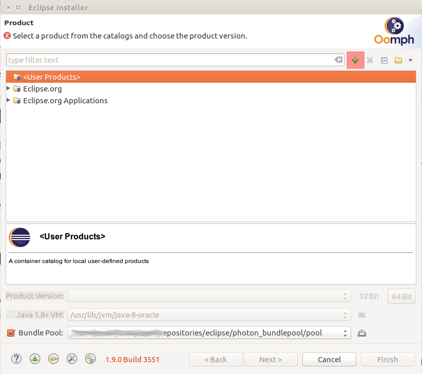
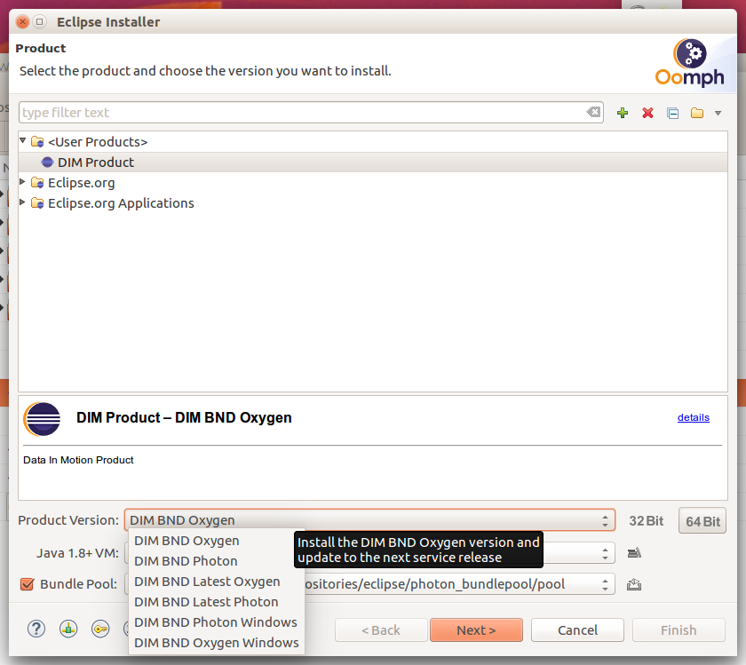

# Geckoproject Eclipse Oomph Setup

This project contains a Eclipse Oomph setup file for the Eclipse IDE installer:

[Eclipse Oomph Project](https://projects.eclipse.org/projects/tools.oomph)

The setup-file brings a default Eclipse IDE with most of the common features installed like:

* JDT
* Bndtools
* PDE
* plantuml
* EMF Modeling SDK
* Dockertools

## Setting up Gecko Eclipse IDE with Oomph

### Download the Oomph installer

The installer can be downloaded here [https://www.eclipse.org/downloads/](https://www.eclipse.org/downloads/).

The downloaded archive must be unpacked. The unpacked folder can be kept, because the installer itself is self-updating. To start the installer call the *eclipse_inst* executable for your system.

### Adding Gecko Setup File

When you initially start with the Oomph installer, you get the simple mode. To go further with our installation, please switch to the *Advanced Mode* hidden in the menu on the upper right corner of the window.

Press the green plus symbol on the top right place of the installer window. It marks the add button for custom Oomph product setups.

Put the following URL in the blank field:

[https://raw.githubusercontent.com/geckoprojects-org/org.gecko.bnd/snapshot/eclipse.oomph/Gecko-IDE.setup](https://raw.githubusercontent.com/geckoprojects-org/org.gecko.bnd/snapshot/eclipse.oomph/Gecko-IDE.setup)

Now you should see, the *Gecko.io IDE* under the category *<User Products>*

### Select your Version

If you select *Gecko.io IDE*, you should find various options in the selection field with label *Product Version*. The displayed version in the screenshot is Gecko BND Photon, but we now the versions are labled after year and month like **2022-03**.

You can go to *Next* and you'll see a list of Eclipse projects. You can skip this page.

### Configure your Installation

Now you are asked for some variable information. Select *Show all variables* on the lower left checkbox. You should see 5 fields:

* **Install Location rule**: - Can be ignored
* **Root install folder** - The folder where youe Eclipse IDE will be installed
* **Installation folder name** - the name of the folder, that will be created in your root installation folder. In this folder usually the *eclipse* folder with the installation files will be created
* **Installation name** - For Linux users only. Under Linux the installer creates a desktop file that can be used in Gnome to find the installation in the application search
* **Workspace Name** - The name of the Eclipse workspace folder. This workspace will always be created in you installation folder path. That is the *root install folder* + *installation folder name* + *workspace name*.

Usually you can now go to the *Finish* section in this wizard, that starts the installation process.

## Create a Geckoprojects GitHub Bnd OSGi Workspace

If Eclipse opens you see the *Welcome Screen*, if you click that away, you will have Bndtool as starting perspective.

Usually you start with creating a new *Bnd OSGi Workspace*. Within this setup you will pass the *Select Workspace Template* page. In this page you should see the **Gecko DIM GitHub Workspace** in the *Workspace Extension* section.

You can directly use this for Data In Motion or Geckoprojects. Otherwise you can also go on with an ordinary **bndtools/workspace**.